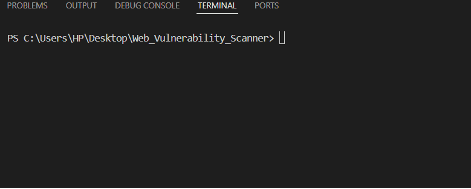

$$ Web XQL (XSS/SQLi) Scanner $$

A lightweight Python-based web vulnerability scanner designed to detect common security flaws such as SQL Injection and Cross-Site Scripting (XSS) using the `requests` and `BeautifulSoup` libraries.

  

# Features

1) Detects basic SQL Injection
2) Identifies Reflected XSS
3) Parses and scans web forms automatically
4) Supports GET and POST methods
5) Clean console output with payload evidence

# Technologies Used

1) Python 3.x
2) Requests
3) BeautifulSoup4

# How it Works

1) Takes a target URL as input
2) Fetches the webpage HTML
3) Extracts all forms using BeautifulSoup
4) Parses form action, method, and inputs
5) Injects SQLi & XSS payloads into input fields
6) Submits forms using GET or POST requests
7) Analyzes response for reflected payloads
8) Flags vulnerable forms
9) Shows a clean summary at the end

# Installation & Usage

1) Install dependencies:
   bash
   pip install -r requirements.txt

2) Enter a target URL like:
   http://testphp.vulnweb.com

3) You can try scanning these legal, intentionally vulnerable sites:    
   http://testphp.vulnweb.com
   http://demo.testfire.net
   https://xss-game.appspot.com

# Future Enhancements

1) Add file-based logging
2) Add support for CSRF detection
3) Add DOM-based XSS support
4) Build a web-based GUI

Made by - Ronak Joshi
- Connect on LinkedIn (www.linkedin.com/in/ronak-joshi-199426364) | Follow on GitHub (https://github.com/ronakjoshi21)

   
